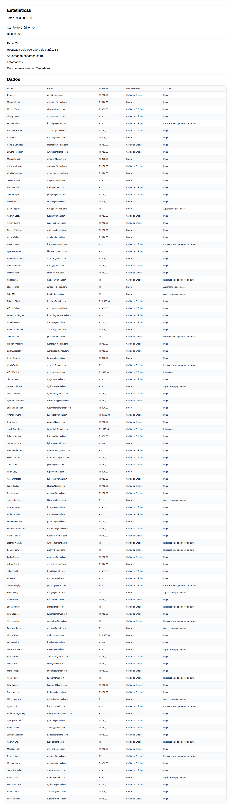

# Análise de Dados Financeiros

Aplicação desenvolvida em HTML, CSS e TypeScript para análise e visualização de dados financeiros obtidos através de uma API.

O projeto realiza a normalização dos dados recebidos, exibe as transações em uma tabela e calcula diferentes estatísticas, como valor total das transações, formas de pagamento, status e dia da semana com maior número de vendas.



## 📊 Funcionalidades

- Consumo de dados através de uma API REST
- Exibição das transações em uma tabela
- Cálculo do valor total das transações
- Contagem de transações por forma de pagamento
- Contagem de transações por status
- Contagem de vendas por dia da semana
- Identificação do dia da semana com maior número de vendas
- Conversão de valores monetários de string para `number`
- Conversão das datas recebidas pela API para objetos `Date`
- Normalização dos dados da API
- Organização do código em módulos TypeScript

## 🛠️ Tecnologias

- HTML5
- CSS3
- TypeScript
- Fetch API
- API REST
- ES Modules

## 🔄 Funcionamento

A aplicação segue as seguintes etapas:

```text
API
 ↓
Fetch dos dados
 ↓
Normalização dos dados
 ↓
Cálculo das estatísticas
 ↓
Exibição dos dados
 ↓
Tabela + Estatísticas
```

---

## 🎯 Objetivo do projeto

Este projeto foi desenvolvido com o objetivo de praticar e demonstrar conhecimentos em:

* TypeScript
* Tipagem estática
* Interfaces e tipos
* Generics
* Classes
* Type Guards
* Manipulação de arrays
* map()
* filter()
* reduce()
* Consumo de APIs
* Manipulação de datas
* Manipulação do DOM
* Modularização
* Normalização de dados

---

## 📌 Projeto

**Análise de Dados Financeiros**

Aplicação desenvolvida para transformar dados brutos de transações em informações organizadas e estatísticas de fácil visualização.

### Consumo da API

Os dados das transações são obtidos através da API:
[https://api.origamid.dev/json/transacoes.json](https://api.origamid.dev/json/transacoes.json)


---


### 🚀 Como executar

**Pré-requisitos**

É necessário ter o TypeScript, Node e NPM instalado no ambiente de desenvolvimento.

**Instalação**

Clone o repositório:
```bash
git clone https://github.com/giosantos99/analise-de-dados-financeiros.git
```

Entre na pasta do projeto:
cd analise-de-dados-financeiros

Instale as dependências:
npm install

**Executando o projeto**

Para iniciar o projeto em modo de desenvolvimento:
npm run dev

Esse comando executa simultaneamente:

* Compilação do TypeScript em modo de observação (watch)
* Servidor local para visualizar a aplicação

A aplicação estará disponível em:
[http://localhost:3000](http://localhost:3000)

---

### 👩‍💻 Desenvolvedora

**Giovanna Santos de Souza**

Projeto desenvolvido para estudo e portfólio.